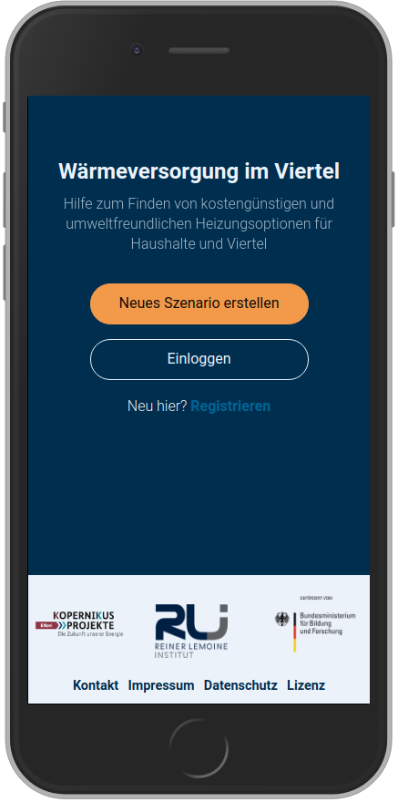

.. _about_label:

Über dieses Tool
================

Die Energiewende kann nur gemeinsam erreicht werden.
Wie aber können alle Interessensgruppen ihre Sichtweisen und Bedürfnisse in die Energiewendeplanung einbringen?
Das `Reiner Lemoine Institut (RLI)
<https://reiner-lemoine-institut.de/>`_ hat dieses Stakeholder-Empowerment-Tool entwickelt,
das es Hausbesitzerinnen und Hausbesitzern ermöglicht, in ihrem Wirkungsraum einen Betrag zur Energiewende zu leisten,
indem sie bei Neuinvestitionen in Heizungsanlagen Technologieabwägungen auf wissenschaftlicher Grundlage treffen können.

.. image:: _static/Waerme_Heizungsoptionen_device.png
  :width: 24%
  :alt: Heizungsoptionen

Über das Menü links gelangen Sie auf die entsprechenden Seiten.

Motivation
----------

Mecklenburg nimmt als Modellregion im Projekt ENavi teil.
Im Landkreis Mecklenburg gibt es bereits verschiedene Aktivitäten im Bereich Energiewende und Daseinsvorsorge.
Im  Frühjahr 2018 mit der Erstellung eines Klimaschutzkonzeptes begonnen,
durch den Komob e.V. wird ländliche Mobilität neu gedacht und es gibt einen Amtsentwicklungsausschuss AG Daseinsvorsorge die sich mit der Zukunft der Region beschäftigt.
In diesen Kontext reiht sich das Stemp Tool ein.
In Zusammenarbeit mit dem LK Mecklenburg und KOMOB e.V. wurden Quartiere in Nordwest-Mecklenburg identifiziert,
die sich für die gemeinsame Entwicklung des Tools eignen.

Hintergrund
-----------

Die ländliche, strukturschwache Region mit abnehmender Bevölkerungszahl, hat die Energiewende in der Region bisher so erlebt:
viele Windparks, wenig regionale Wertschöpfung, wenig Partizipationsmöglichkeiten.
Im Bereich Wärmeversorgung wurde Anfang der 1990er Jahre in vielen Gebäuden in der Region die Wärmeversorgung erneuert,
meist durch dezentrale Öl- oder Gasthermen. Nach fast 30 Jahren Nutzung steht in den kommenden Jahren eine Erneuerung an.
An dieser Stelle soll das Stemp-Tool eingesetzt werden und den Entscheidungsprozess zu einer neuen Wärmeversorgung unterstützen.
Hier ist jetzt der günstige Moment, eine Investitionsentscheidung die ansteht zu Nutzen um die Wärmewende ein Stück weiter voranzubringen.

Ziele
-----
Mit dem Stemp - Tool für die Region Nordwest-Mecklenburg verfolgen das Reiner Lemoine Institut und der Landkreis folgende Ziele:

- Identifikation der Werte und Interessen der regionalen Akteure
- Verbesserung des Verständnisses von Zusammenhängen zwischen technischen, energiewirtschaftlichen und ökologischen Eigenschaften von Heizungssystemen
- Transparente und interessensneutrale Bereitstellung von Informationen zu verschiedenen Heizungstechnologien auf wissenschaftlicher Grundlage aber in der Darstellung an die Zivilgesellschaft angepasst.
- Befähigung, bessere Entscheidungen treffen zu können
- Beitrag zu ‚Daseinsvorsorge‘ damit die Region durch die Energiewende nachhaltig profitieren kann anstatt abgehängt zu werden
- Bereitstellung von Daten und Quellcode, um die Umsetzung ähnlicher Tools zu erleichtern.

ENavi
-----
Das Tool wurde im Kopernikus-Projekt
„`ENavi <https://www.kopernikus-projekte.de/projekte/systemintegration>`_“
entwickelt, einem von vier Projekten der Förderinitiative Kopernikus des
Bundesministeriums für Bildung und Forschung (BMBF).

Förderkennzeichen: 03SFK4E1

::

  „Mit der Energiewende hat sich Deutschland zum Ziel gesetzt, das gegenwärtige
  Energiesystem in ein weitgehend CO2-freies und auf erneuerbaren Energien
  basierendes System zu transformieren. Ein wirtschaftliches,
  umweltverträgliches, verlässliches und sozialverträgliches Energiesystem
  benötigt eine ganzheitliche Betrachtung auf Systemebene. ENavi sieht die
  Energiewende daher als einen gesamtgesellschaftlichen Transformationsprozess
  und verknüpft wissenschaftliche Analysen mit politisch-gesellschaftlichen
  Anforderungen.“

Lizenz
------

*Copyright (C) 2018 Reiner Lemoine Institut gGmbH*

Dieses Programm ist Freie Software: Sie können es unter den Bedingungen
der GNU General Public License, wie von der Free Software Foundation,
Version 3 der Lizenz oder (nach Ihrer Wahl) jeder neueren
veröffentlichten Version, weiter verteilen und/oder modifizieren.

Dieses Programm wird in der Hoffnung bereitgestellt, dass es nützlich sein wird,
jedoch OHNE JEDE GEWÄHR,; sogar ohne die implizite
Gewähr der MARKTFÄHIGKEIT oder EIGNUNG FÜR EINEN BESTIMMTEN ZWECK.
Siehe die GNU General Public License für weitere Einzelheiten.

Sie sollten eine Kopie der GNU General Public License zusammen mit diesem
Programm erhalten haben. Wenn nicht, siehe <https://www.gnu.org/licenses/>.

This program is free software: you can redistribute it and/or modify
it under the terms of the GNU General Public License as published by
the Free Software Foundation, either version 3 of the License, or
(at your option) any later version.

This program is distributed in the hope that it will be useful,
but WITHOUT ANY WARRANTY; without even the implied warranty of
MERCHANTABILITY or FITNESS FOR A PARTICULAR PURPOSE.  See the
GNU General Public License for more details.

You should have received a copy of the GNU General Public License
along with this program.  If not, see <http://www.gnu.org/licenses/>.
