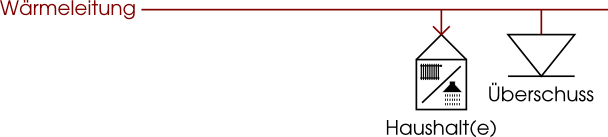
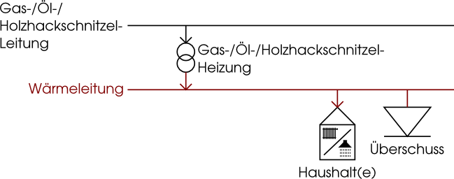
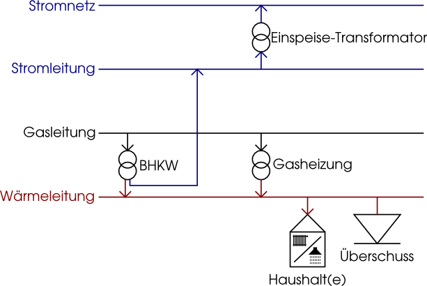
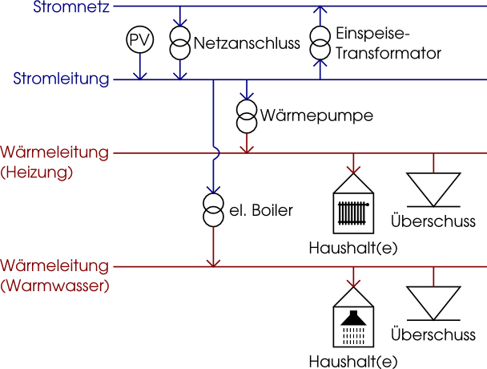

.. _energy_system_label:

Energiesystem
=============

Die Berechnungen dieses StEmp-Tools umfassen u.a. die Erzeugung, den Bedarf und
die Speicherung von elektrischer und thermischer Energie über ein Kalenderjahr.
Was auf den ersten Blick wie eine simple Bilanzierung von Energiemengen anmuten
könnte, ist in Wirklichkeit ein Energiesystemmodell, das mit Hilfe einer
linearen Optimierung gelöst wird.

Die Eingangsparameter für das Modell sind einerseits vorberechnete Daten wie
beispielsweise Zeitreihen zur Einspeisung oder Heizwärmebedarf und andererseits
die durch den/die BenutzerIn einstellbaren Größen wie z.B. Erdgaspreis oder Installationskosten der Technologien.
Die Ergebnisse werden im Anschluss an die Optimierung aufbereitet und im Tool dargestellt.

Für die Optimierung wird das vom RLI mitentwickelte
`Open Energy System Modelling Framework (oemof) <https://oemof.readthedocs.io/en/stable/index.html>`_
eingesetzt. oemof ist ein freies, offenes und gut dokumentiertes Framework für
die Modellierung und Optimierung von Energieversorgungssystemen.

Technologien
------------

Im folgenden werden die zugrundeliegenden Energiesystememodelle für jede Technologie dargestellt und erläutert.
Grundlage für alle Szenarien (mit leichter Abweichung im Falle des PV/Wärmepumpen-Szenarios) ist das folgende Verbrauchermodell:

Ein oder mehrere Haushalte sind an die Wärmeleitung angeschlossen und können über diese mit Wärme versorgt werden.
Warmwasser- und Heizungsbedarf sind hierbei vereinfachend zusammengefasst als ein Wärmebedarf.
Zusätzlich ist ein Wärmeüberschuss-Verbraucher angeschlossen, der Wärmeüberschüsse ableiten kann (notwendig aus Modellierersicht).
Auf diesem Grundmodell aufbauend werden, je nach Technologie, verschiedene Heizsysteme und zusätzliche Leitungen angeschlossen.

.. note:: Im Falle eines Viertels werden alle verwendeten Haushalte zu einem einzelnen Haushalt zusammengefasst. Die verschiedenen Wärmebedarfe werden dabei übereinandergelegt und aufsummiert.

Gas-/Öl-/Holzhackschnitzelheizung
#################################

Über eine einfache Leitung und eine angeschlossene Heizung (einfacher Transformator) wird der Wärmebedarf versorgt.
Das zugrundeliegende Modell für Gas-, Öl- und Holzhackschnitzel (Modell ist für alle drei Technologien identisch) ist wie folgt:

Blockheizkraftwerk
##################

Das Modell für ein Blockheizkraftwerk (Erdgas und Biogas) beinhaltet zwei zusätzliche Stromleitungen.
Die (lokale) Stromerzeugung des Kraftwerks kann mithilfe eines Transformators (gewinnbringend) in das Stromnetz eingespeist werden.
Zusätzlich zum Blockheizkraftwerk ist eine einfache Gasheizung installiert, die im Falle von extremen Wärmebedarf eingeschaltet werden kann.

.. note::
  Die zusätzliche Gasheizung dient dazu Spitzenbedarf abzufangen.
  Anderernfalls müsste das Blockheizkraftwerk so überdimensioniert werden, dass es auch extremen Wärmebedarf decken kann.
  Das Blockheizkraftwerk könnte dann nicht mehr wirtschaftlich betrieben werden.

Photovoltaik-Wärmepumpe
#######################

Für die Photovoltaik-Wärmepumpen-Technologie muss das Verbrauchermodell angepasst werden.
Der Wärmedarf muss nach Warmwasser und Heizung getrennt werden, da die Wärmepumpe allein nicht die nötige Heizwärme für Warmwasser bereitstellen kann.
Für diesen Fall ist zusätzlich ein elektrischer Boiler angeschlossen.
Wie im Falle des Blockheizkraftwerkmodells sind zwei zusätzliche Stromleitungen (lokal und Netzanschluss) vorhanden.
Der elektrische Boiler und die Wärmepumpe können Strom über die lokale Stromleitung beziehen, die ihrerseits Strom (im günstigen Fall) über die angeschlossene Photovoltaikanlage oder (im ungünstigen Fall) über den Netzanschluss bezieht.
Über einen weiteren Transformator können Stromüberschüsse aus der Photovoltaikanlage (gewinnbringend) in das Netz eingespeist werden.

