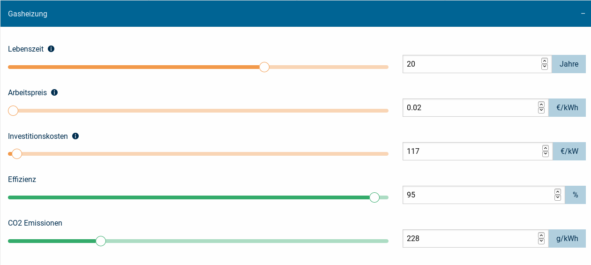

.. _usage_label:

Verwendung
==========

Eine kurze Einführung in das Tool ist bereits auf der `Startseite
<https://wam.rl-institut.de/stemp/>`_ gegeben. Im Folgenden werden die
wichtigsten Elemente und Funktionen der Benutzeroberfläche beschrieben.

Aufbau des Tools
----------------

Das Tool führt schrittweise von der Bestimmung des Wärmebedarfs eines Haushalts oder Viertels hin zum Vergleich verschiedener Heizungsoptionen.
Die Schritte in denen durch das Tool geführt wird sind Folgende:

#. Erstellung eines Haushalts **oder**
#. Erstellung eines Viertels (bestehend aus mehreren Haushalten)
#. Auswahl der zu vergleichenden Heizungstechnologien
#. Anpassung der Parameter der verwendetenen Heizungstechnologien
#. Zusammenfassung der vorherigen Schritte
#. Berechnung der Ergebnisse und Vergleich der Szenarien

Die Schritte werden im folgenden genauer erläutert.

Erstellung eines Haushalts
--------------------------

Ein einzelner Haushalt kann entweder mit individuellen Angaben erstellt werden, oder als vordefinierter bzw. gespeicherter Haushalt aus einer Liste gewählt werden:

Soll ein Haushalt aus einer **Liste** gewählt werden, erfolgt dies über den Namen des Haushalts.
Nach Auswahl eines Haushaltes werden zusätzlich die Angaben zur Anzahl der Personen, verfügbarer Dachfläche und Energiebedarf (Heizung und Warmwasser getrennt) eingeblendet:

.. image:: _static/HH_liste.png
   :width: 600 px
   :alt: Haushalt aus Liste wählen
   :align: center

Bei der **benutzerdefinierten** Erstellung eines Haushalts, wird zuerst ein eindeutiger Name vergeben.
Anschließend werden Angaben zur Anzahl der Personen und zum Haustyp (Einfamilienhaus/Mehrfamilienhaus) beantwortet:

.. image:: _static/HH_name_typ.png
   :width: 600 px
   :alt: Angaben zu Name, Anzahl Personen und Haushaltstyp
   :align: center

Basierend auf der Anzahl der Personen werden automatisch standardisierte Werte für die folgenden Angaben (Grundfläche, Energiebedarf, usw.) ermittelt und zur Verfügung gestellt.
Grundsätzlich ist der Standardwert für alle Angaben ausgewählt.
Abweichend vom Standardwert können benutzerdefinierte Werte eingegeben werden, indem das Feld "Manuell eingeben" ausgewählt wird und der dortige Wert entsprechend angepasst wird (hier am Beispiel der Grundfläche):

|grundfläche_standard| --> |grundfläche_individuell|

.. |grundfläche_standard| image:: _static/HH_grundfläche.png
   :width: 140 px

.. |grundfläche_individuell| image:: _static/HH_grundfläche_ind.png
   :width: 140 px

Weiterhin werden folgende Angaben ermittelt:

Heizung:
  Der Energiebedarf durch die benötigte Heizwärme kann eingestellt werden.
  Außerdem kann der eingebaute Heizungstyp (Heizkörper oder Fussbodenheizung) angegeben werden.
  Der Energiebedarf pro Jahr wird zusätzlich rechts noch einmal eingeblendet.

.. note:: Der Heizungstyp wird in der aktuellen Version des Tools nur dazu verwendet, um eine Warnung einzublenden falls die Heizungsoption "Wärmepumpe" in Verbindung mit dem Heizungstyp "Heizkörper" ausgewählt wurde (Diese Kombination ist technisch schwieriger umzusetzen).

Warmwasser:
  Der Warmwasserverbrauch pro Tag kann mittels dreier Stufen (gering, mittel, stark) eingestellt werden.
  Der resultierende Energiebedarf pro Jahr ist rechts eingeblendet.

Dachfläche:
  Die verfügbare Dachfläche kann angegeben werden.
  Diese wird benötigt, um eine Obergrenze für die mögliche Größe einer zu installierenden Photovoltaikanlage berechnen zu können.

.. image:: _static/HH_dachfläche.png
   :width: 600 px
   :alt: Dachfläche des Haushalts
   :align: center

Erstellung eines Viertels
-------------------------

Die Erstellung eines Viertels erfolgt, indem mehrere Haushalte zu einem Viertel zusammengefasst werden.
Dazu können beliebig viele Einfamilienhäuser und Mehrfamilienhäuser dem zunächst leeren Viertel hinzugefügt werden.
Alternativ kann ein bestehendes Viertel geladen werden und anschließend angepasst werden:

Bei Klick auf "Einfamilienhaushalt hinzufügen" bzw. "Mehrfamilienhaushalt hinzufügen" öffnet sich die Seite zur Erstellung eines Haushalts.
Dort kann, wie unter `Erstellung eines Haushalts`_ beschrieben, ein Haushalt erstellt oder aus einer Liste geladen werden.
Anschließend wird der gewählte Haushalt dem Viertel hinzugefügt.
Die Anzahl eines Haushalts kann zusätzlich angepasst werden; der Haushalt ist entsprechend oft im Viertel vorhanden und der Energiebedarf ist entsprechend erhöht:

.. note:: Die Möglichkeit der Einstellung der Haushaltsanzahl soll eine archetypische Generierung verschiedener Haushaltstypen ermöglichen, ohne jeden Haushalt einzeln erstellen zu müssen.

Auswahl der Heizungstechnologien
--------------------------------

In diesem Schritt werden die zu vergleichenden Technologien ausgewählt.
Eventuelle Einschränkungen und Hinweise sind den Technologien in grau hinzugefügt:

Zur Verfügung stehen in der aktuellen Version folgende Technologien:

* Gasheizung
* Erdgas-Blockheizkraftwerk + Gaskessel
* Biogas-Blockheizkraftwerk + Gaskessel
* Ölheizung
* Holzhackschnitzel-Heizung
* Photovoltaik + Wärmepumpe + elektrischer Boiler

Erläuterungen zur Funktionsweise der einzelnen Technologien können per Klick auf das jeweilige Technologie-Symbol eingesehen werden.
Die Technologien und die daraus resultierenden Szenarien werden unter :ref:`scenarios_label` genauer betrachtet.
Für alle ausgewählten Technologien können anschließend die Parameter angepasst werden (siehe `Anpassung der Parameter`_).
Auf der Ergebnisseite (siehe `Ergebnisse`_) werden schließlich die ausgewählten Technologien untereinander verglichen.

Anpassung der Parameter
-----------------------

.. note::
  [Expertenmodus] Alle Parameter sind auf Standardwerte eingestellt, die nach bestem Wissen und Gewissen recherchiert wurden (siehe auch Quellenangaben dazu).
  Änderungen an den Parametern sollten nur von "Experten" vorgenommen werden. Für die Verlässlichkeit der daraus resultierenden Ergebnisse können wir nicht garantieren.

Alle einstellbaren Parameter sind nach Technologien gruppiert:

Per Klick auf eine Technologie, öffnen sich die zugehörigen Parameter und können angepasst werden:

Die Parameter werden farblich unterschieden zwischen orange - entspricht ökonomischen Einstellungen - und grün - entspricht technologischen Einstellungen.
Der Wert der jeweiligen Einstellung kann mittels Schieberegler oder per manueller Eingabe daneben angepasst werden.
Bei der manuellen Eingabe sind minimal und maximal Werte zu beachten - die Einstellungen werden nach der Eingabe automatisch angepasst.
Die zughörige Einheit des Parameters ist in der blauen Box rechts angegeben.
Außerdem sind für einige Einstellungen kuzre Erläuterungen zum besseren Verständnis hinterlegt (?).

Zusammenfassung
---------------

In der Zusammenfassung werden alle Einstellungen des Szenarios (Haushalt/Viertel, Technologien und Parameter) aufgelistet.
Ein Klick auf "Fertig" startet anschließend die Berechnung der zugehörigen Ergebnisse.
Sollte es noch Änderungsbedarf an den Einstellungen geben, kann über das Feld "Ändern" zu den jeweiligen Einstellungen zurückgesprungen werden.

.. note::
  Werden Änderungen an vorherigen Einstellungen vorgenommen, werden in der aktuellen Version leider keine späteren Änderungen gespeichert.
  Dass heißt, werden Änderungen am Haushalt vorgenommen, müssen anschließend gegebenenfalls erneut Technologien und zugehörige Parameter angepasst werden.
  In einer zukünftigen Version soll dafür Abhilfe geschaffen werden.

Ergebnisse
----------

Auf der Ergebnisseite werden die ausgewählten Technologien miteinander verglichen.
Zur Zeit werden folgende Ergebnisse für jedes Szenario tabellarisch ausgegeben:

* Wärmekosten
* Investitionskosten
* Brennstoffkosten
* CO2 Emissionen
* Primärenergiefaktor
* Primärenergie

Zusätzlich werden allgemeine "weiche" Faktoren als Vor- und Nachteile stichpunktartig ergänzt.
Erläuterungen zu den einzelnen Vergleichen können über das ?-Symbol eingeholt werden.
Die Technologien werden qualitativ verglichen; dazu werden die Technologien farblich als qualitativ "gut" (grün), "neutral" (beige) und "schlecht" (rot) markiert:

.. warning::
  Der qualitative Vergleich findet nur unter den ausgewählten Szenarien statt!
  Generelle qualitative Aussagen über einzelne Szenarien können dadurch nicht getroffen werden.
  Werden zum Beispiel nur Technologien mit sehr hohen Investitionskosten verglichen, werden die Investionskosten einer Technologie als "gut" eingestuft, obwohl diese im Vergleich mit einer anderen (nicht ausgwählten) Technologie eventuell sehr viel schlechter wären.

Die Wärmekosten werden zusätzlich als Grafik angezeigt,
wobei die Kosten zusätzlich nach Betriebskosten, Brennstoffkosten, Investionskosten und Strombezugskosten aufgeschlüsselt werden,
sowie mögliche Stromgutschriften von den Gesamtkosten abgezogen werden:

.. note::
  Die tatsächlichen Wärmekosten jeder Technologie sind als schwarze Linie eingezeichnet.
  Diese sind notwendig um "negative Kosten", in diesem Falle also eine Stromgutschrift, berücksichtigen zu können.

.. note::
  Jedes Szenario erhält intern eine eindeutige ID, über diese ID können Szenarien miteinander verglichen werden.
  Zur Zeit kann dies leider nur manuell über den Browser geschehen, indem die zu vergleichenden Szenarien-IDs als komma-getrennte Liste zu der Ergebnis-URL hinzugeügt werden (z.B. https://wam.rl-institut.de/stemp/result/117,118,116,119 )
